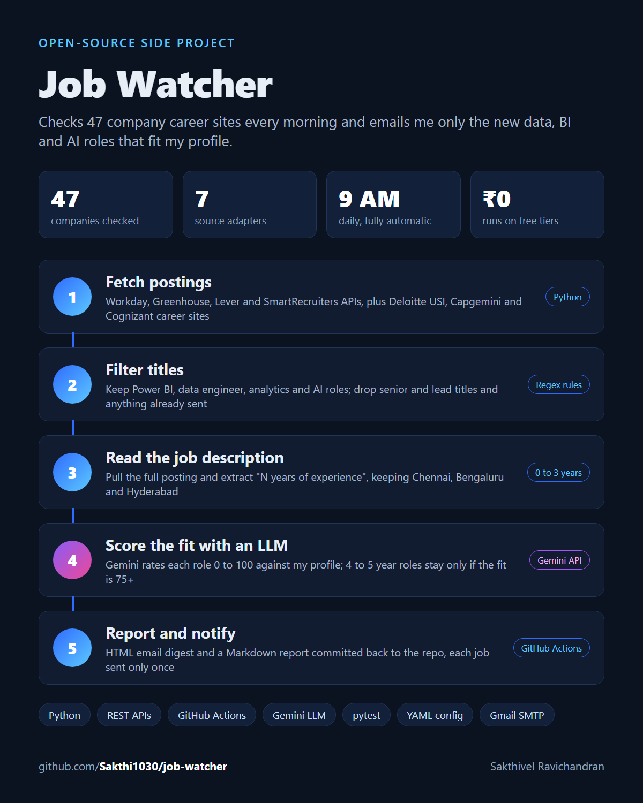

# Job Watcher



A small pipeline that checks the career sites of 45+ companies every morning, keeps only the
roles that match my profile, scores them with an LLM, and emails me the new ones.

Job boards show everything; this shows only what is new **and** relevant: data, BI and AI
roles in Chennai, Bengaluru and Hyderabad that ask for 0 to 3 years of experience, plus
4 to 5 year "stretch" roles when the LLM rates the fit 75 or higher.

## How it works

```
GitHub Actions (daily 09:00 IST)
        │
        ▼
 Fetch postings ──► 7 source adapters: SmartRecruiters, Greenhouse, Lever, Workday APIs,
        │           plus Deloitte USI, Capgemini and Cognizant career-site parsers
        ▼
 Filter titles ───► include (Power BI, data engineer, analytics…) / exclude (senior, lead…)
        │           skip postings already seen (data/seen.json)
        ▼
 Enrich ──────────► fetch full descriptions, extract "N years of experience"
        │
        ▼
 Filter ──────────► India locations, minimum experience ≤ 3 years
        │
        ▼
 Score (optional) ► Gemini rates fit 0–100 against my profile, with a one-line reason
        │
        ▼
 Report ──────────► reports/latest.md committed to the repo + HTML email via Gmail
```

Each job is reported once. State lives in `data/seen.json`, which the workflow commits back
to the repo, so no database or server is needed and the whole thing runs on the free tier.

## Configure

- `config/companies.yaml`: the companies to watch. Adding one is one line: pick the ATS the
  company uses (look at its careers URL) and copy an existing entry.
- `config/profile.yaml`: search terms, title include/exclude patterns, locations, maximum
  required experience, and the candidate summary used for LLM scoring.

## Run locally

```bash
pip install -r requirements.txt
python -m job_watcher --dry-run                 # print matches, change nothing
python -m job_watcher --dry-run --company "Deloitte USI"
python -m job_watcher --no-email                # save state and report, no email
python -m job_watcher --resend-all              # email every current match, not just new ones
python -m pytest -q
```

## Run daily on GitHub Actions

Add these repository secrets (Settings → Secrets and variables → Actions):

| Secret | Purpose |
|---|---|
| `GMAIL_USER` | Gmail address that sends the email |
| `GMAIL_APP_PASSWORD` | a Gmail [app password](https://myaccount.google.com/apppasswords) (not your normal password) |
| `MAIL_TO` | where to send it (optional, defaults to `GMAIL_USER`) |
| `GEMINI_API_KEY` | optional; enables the fit score ([get a free key](https://aistudio.google.com/apikey)) |
| `CANDIDATE_SUMMARY` | optional; your profile in plain text for fit scoring, kept private (falls back to `candidate_summary` in `profile.yaml`) |

The workflow in `.github/workflows/job-watch.yml` runs every day at 09:00 IST and can also be
started by hand from the Actions tab. Without the email secrets it still writes
`reports/latest.md`.

## Notes

- Only public career-site endpoints are used, at one request per search term per company per
  day. LinkedIn is deliberately not scraped.
- Experience is extracted with a regular expression, so an unusual phrasing can be missed;
  such postings are kept and marked "not stated" rather than dropped.
